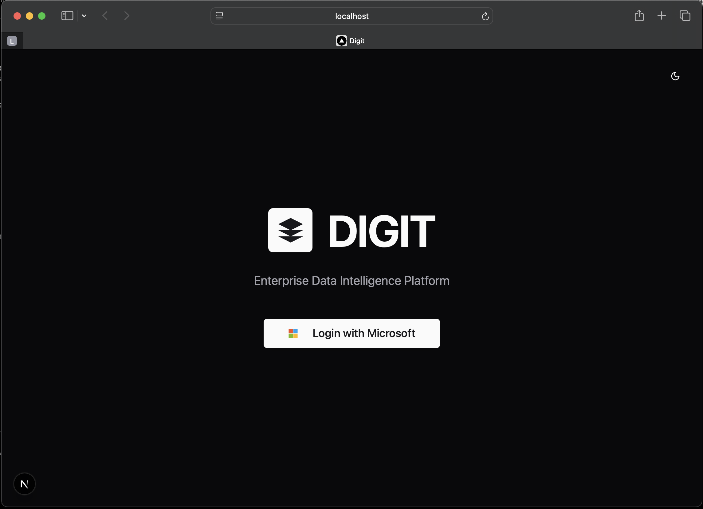
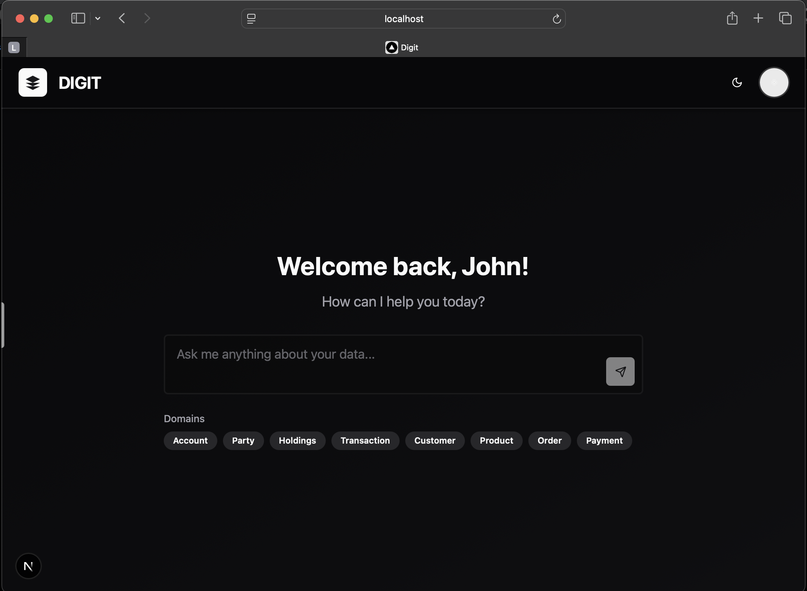
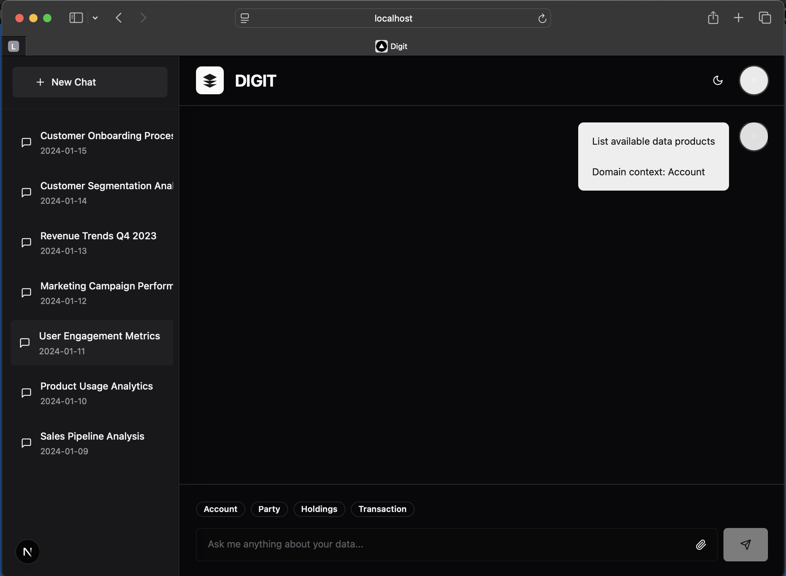

# DigitChat

A modern AI-powered chat application built with Next.js, featuring real-time conversations, data visualization, and Model Context Protocol (MCP) integration.

[](https://v0.dev/chat/projects/PrtwFAXCyjN)
[](https://opensource.org/licenses/MIT)

## Features

- 🤖 **AI-Powered Conversations**: Advanced chat capabilities with OpenAI integration
- 📊 **Data Visualization**: Interactive charts, heatmaps, treemaps, and geospatial visualizations
- 🔌 **MCP Integration**: Model Context Protocol support for enhanced AI capabilities
- 🎨 **Modern UI**: Beautiful interface built with Tailwind CSS and Radix UI components
- 📱 **Responsive Design**: Works seamlessly across desktop and mobile devices
- 🔐 **Authentication**: Secure Microsoft SSO authentication and session management
- ⚡ **Real-time Updates**: Live chat updates and status indicators

## Tech Stack

- **Framework**: Next.js 14 with App Router
- **Styling**: Tailwind CSS
- **UI Components**: Radix UI
- **AI Integration**: OpenAI SDK
- **Authentication**: Microsoft Authentication Library (MSAL)
- **State Management**: React Hooks
- **Package Manager**: npm

## Getting Started

### Prerequisites

- Node.js 18+ 
- npm

### Installation

1. Clone the repository:
```bash
git clone https://github.com/your-username/digit-ui.git
cd digit-ui
```

2. Install dependencies:
```bash
npm install
```

3. Set up environment variables:
```bash
cp .env.example .env.local
```

4. Configure Azure AD and add environment variables to `.env.local`:

#### Azure AD Setup
1. Go to the [Azure Portal](https://portal.azure.com)
2. Navigate to Azure Active Directory > App registrations
3. Click "New registration" and create a new app
4. Set the redirect URI to `http://localhost:3000` (for development)
5. Note down the Application (client) ID and Directory (tenant) ID
6. Under "Authentication", enable "Access tokens" and "ID tokens"

#### Environment Variables
```env
# Azure AD Configuration
NEXT_PUBLIC_AZURE_CLIENT_ID=your-azure-client-id-here
NEXT_PUBLIC_AZURE_TENANT_ID=your-azure-tenant-id-here
NEXT_PUBLIC_REDIRECT_URI=http://localhost:3000
NEXT_PUBLIC_POST_LOGOUT_REDIRECT_URI=http://localhost:3000

# OpenAI API Key
OPENAI_API_KEY=your-openai-api-key-here
```

5. Run the development server:
```bash
npm run dev
```

6. Open [http://localhost:3000](http://localhost:3000) in your browser.

## Project Structure

```
├── app/                    # Next.js app directory
│   ├── api/               # API routes
│   ├── globals.css        # Global styles
│   ├── layout.tsx         # Root layout
│   └── page.tsx           # Home page
├── components/            # React components
│   ├── ui/               # Reusable UI components
│   ├── chat-*.tsx        # Chat-related components
│   └── *-artifact.tsx    # Visualization components
├── hooks/                # Custom React hooks
├── lib/                  # Utility functions and clients
├── public/               # Static assets
└── styles/               # Additional stylesheets
```

## Usage

1. **Start a Conversation**: Click on "New Chat" to begin a conversation with the AI
2. **Visualize Data**: Ask the AI to create charts, graphs, or other visualizations
3. **MCP Tools**: Access enhanced AI capabilities through the MCP tools panel
4. **Manage Chats**: Use the sidebar to navigate between different chat sessions

## Screenshots

### Login Screen


### Welcome Screen


### Chat Screen


## Contributing

1. Fork the repository
2. Create a feature branch: `git checkout -b feature/your-feature-name`
3. Make your changes and commit them: `git commit -m 'Add some feature'`
4. Push to the branch: `git push origin feature/your-feature-name`
5. Open a pull request

## License

This project is licensed under the MIT License - see the [LICENSE](LICENSE) file for details.

## Support

If you encounter any issues or have questions, please open an issue on GitHub.
